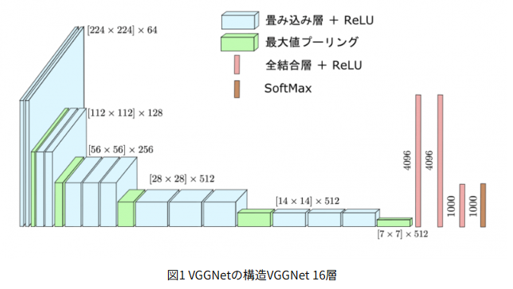
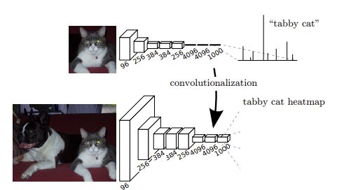
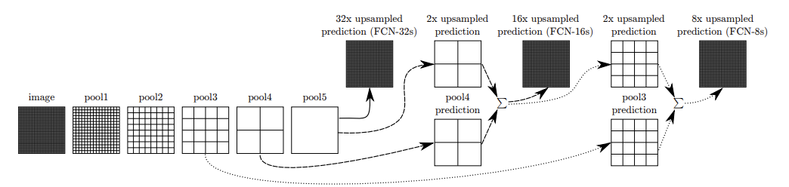
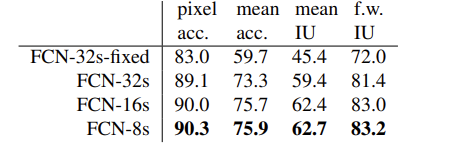
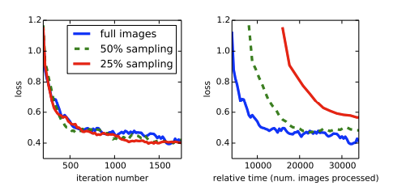
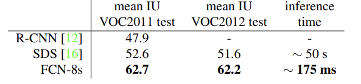

<!--
headingDivider: 1
-->

# Abstract

畳み込みネットワーク（Convolutional networks）は、特徴の階層を生み出す強力な視覚モデルです。

私たちは、ピクセルからピクセルへとエンドツーエンドで学習された畳み込みネットワークだけで、セマンティックセグメンテーションにおける最先端の手法を凌駕できることを示します。

私たちの主要な洞察は、「完全畳み込み（fully convolutional）」ネットワークを構築することにあります。

これは、任意のサイズの入力を受け取り、対応するサイズの出力を効率的に推論・学習することが可能なネットワークです。

---

私たちは、完全畳み込みネットワークの空間を定義し、密な予測タスク（spatially dense prediction tasks）へのその応用を説明し、従来のモデルとの関連性を導き出します。私たちは、現代の分類ネットワーク（AlexNet [19]、VGG net [31]、および GoogLeNet [32]）を完全畳み込みネットワークに適応させ、それらの学習済み表現をファインチューニング [4] によってセグメンテーションタスクに転用します。

その上で、深く粗い層からのセマンティック情報と、浅く詳細な層からの見た目に関する情報とを結びつけて、正確かつ詳細なセグメンテーションを生み出す新しいアーキテクチャを定義します。

私たちの完全畳み込みネットワークは、PASCAL VOC（2007年）におけるセグメンテーションで最先端の性能を達成しました（2012年のmean IUに対して相対的に62.2%の改善）。

また、NYUDv2やSIFT Flowにおいても優れた結果を出し、推論は典型的な画像1枚あたり1/5秒以下で済みます。

# 1.Introduction

畳み込みネットワーク（Convolutional networks）は、認識技術の進展を牽引しています。
ConvNet（畳み込みネットワーク）は、画像全体の分類 [19, 31, 32] において性能が向上しているだけでなく、構造化された出力を伴う局所的なタスクにおいても進歩を見せています。これには、バウンディングボックスを用いた物体検出 [29, 12, 17]、部分およびキーポイントの予測 [39, 24]、局所対応 [24, 9] における進展が含まれます。

粗い推論から細かい推論への発展における自然な次のステップは、あらゆるピクセルに対して予測を行うことです。これまでのアプローチでも、ConvNet をセマンティックセグメンテーションに使用してきました [27, 2, 8, 28, 16, 14, 11]。このセマンティックセグメンテーションでは、各ピクセルがそれを含む物体や領域のクラスでラベリングされますが、従来の手法には本研究が解決するいくつかの欠点がありました。

---

私たちは、**完全畳み込みネットワーク（Fully Convolutional Network, FCN）**が、エンドツーエンドで、ピクセルからピクセルへのセマンティックセグメンテーションを通じて学習されることで、追加の機構なしに最先端の性能を超えることを示します。

私たちの知る限り、これは以下の2点においてFCNをエンドツーエンドで訓練した最初の研究です：
(1) ピクセル単位での予測のための訓練
(2) 教師あり事前学習からの訓練

既存のネットワークを完全畳み込みに変換したバージョンでは、任意のサイズの入力から密な出力（dense output）を予測できます。

学習および推論はどちらも、密な順伝播計算と誤差逆伝播によって、画像全体を一度に処理して実行されます。

ネットワーク内部のアップサンプリング層（in-network upsampling layers）は、サブサンプリングされたプーリングを含むネットワークにおいて、ピクセル単位の予測および学習を可能にします。

# 3.Fully convolutional networks

畳み込みニューラルネットワーク（ConvNet）の基本的な構成要素（**畳み込み、プーリング、活性化関数**）は、下記の様に一般化できる。

特定の層において、位置 $(i, j)$ のデータベクトルを $\mathbf{x}_{ij}$、次の層の出力を $\mathbf{y}_{ij}$ と表記すると、これらの関数は以下のようにして出力 $\mathbf{y}_{ij}$ を計算します：

$$
\mathbf{y}_{ij} = f_{ks} \left( \{ \mathbf{x}_{si+\delta_i, \, sj+\delta_j} \}_{0 \leq \delta_i, \delta_j \leq k} \right)
$$

---

ここで、  
- $k$：カーネルサイズ（kernel size）  
- $s$：ストライドまたはサブサンプリング係数（stride or subsampling factor）  
- $f_{ks}$：層のタイプを決定する関数  
  - たとえば、畳み込みや平均プーリングなら行列積、最大プーリングなら空間的最大値、活性化関数なら要素ごとの非線形変換などを意味します。

---

VGGNetなどは、

$$
\mathbf{y}_{ij} = f_{ks} \left( \{ \mathbf{x}_{si+\delta_i, \, sj+\delta_j} \}_{0 \leq \delta_i, \delta_j \leq k} \right)
$$

の形式で表現できない計算を含む（全結合層）

---

一方、

$$
\mathbf{y}_{ij} = f_{ks} \left( \{ \mathbf{x}_{si+\delta_i, \, sj+\delta_j} \}_{0 \leq \delta_i, \delta_j \leq k} \right)
$$

の形式の層のみで構成されたネットワークを全結合畳み込みネットワーク（Fully Convolutional Network, FCN） と呼びます。

FCNは、自然に任意のサイズの入力に対して動作し、それに対応する（再サンプリングされた可能性のある）空間次元の出力を生成できる。

---

FCN（全結合畳み込みネットワーク）で構成された実数値の損失関数は、あるタスクを定義します。  

もし損失関数がセグメンテーションの様に、最終層の空間的次元にわたる総和であるなら、

$$
\ell(\mathbf{x}; \theta) = \sum_{ij} \ell'(\mathbf{x}_{ij}; \theta)
$$

のように表される。

この時、$\ell'$　は最終層の各ピクセルの損失を表す。　

したがって、画像全体に対して計算された損失 $\ell$ に対して確率的勾配降下法（SGD）を適用することは、$\ell'$ に対してのSGDと同じことになり、最終層のすべての受容野を1つのミニバッチとして扱うことと同義です。

## 3.1.Adapting classifiers for dense prediction

典型的な認識ネットワーク、たとえば LeNet、AlexNet、およびその深層の後継モデルなどは、一見すると固定サイズの入力を受け取り、**空間的情報を持たない出力（nonspatial outputs）** 　（各クラスの出力確率を表すベクトル）を生成するように設計されています。

これらのネットワークにおける全結合層（fully connected layers）は固定された次元を持ち、空間的な座標情報を破棄します。

---

しかし、これらの全結合層も、入力領域全体をカバーするカーネルを持つ畳み込み演算として見なすことができます。

このように捉えることで、これらのネットワークは任意のサイズの入力を受け取り、分類マップ（classification maps）を出力する  **完全畳み込みネットワーク（fully convolutional networks）** として再解釈することが可能になります。

この変換は図2に示されています。

---

図2.全結合層を畳み込み層に変換することで、分類ネットワークはヒートマップを出力できるようになります。

1000次元の最終分類層を削除し、デコンボリューションレイヤー、空間的損失を追加することで、エンドツーエンドの高密度学習を効率的に行うための機構が構築されます。

---

さらに、得られるマップは元のネットワークを個別の入力パッチに適用した際の出力と**同等**であるものの、 計算は **これらのパッチにおける重複領域をまたいで効率的に共有（amortized）** されています。

たとえば、**AlexNet** は（一般的なGPU上で） **227 × 227の画像の分類スコアを生成するのに1.2ミリ秒** かかりますが、 **完全畳み込みバージョン**では、**500 × 500の画像から10 × 10の出力グリッドを生成するのに22ミリ秒** しかかかりません。

これは、 **素朴な方法（naïve approach）に比べて5倍以上高速** であることを意味します。

---

私たちが分類ネットワークを完全畳み込みネットワーク（FCN）として再解釈することにより、
任意のサイズの入力に対する出力マップを生成できるようになりますが、
その出力の空間サイズは通常、サブサンプリングによって縮小されます。

分類ネットワークでは、フィルターサイズを小さく保ち、計算コストを抑えるためにサブサンプリングが行われます。

その結果、これらのネットワークの完全畳み込み版における出力も粗くなり、
出力ユニットの受容野におけるピクセルストライドと等しい比率で、入力サイズよりも小さな出力サイズとなります。

---

## 3.2.Shift-and-stitch is filter rarefaction

**入力のシフトと出力のインターレース**は、補間なしで粗い出力から高密度な予測を得るためのテクニックであり、**OverFeat [29]** によって導入されました。

もし出力が係数 $f$ でダウンサンプリングされている場合、入力は $x$ ピクセルだけ右に、$y$ ピクセルだけ下にシフトされます（左および上方向へのパディングを伴って）。この処理は、すべての $(x, y) \in \{0, \ldots, f - 1\} \times \{0, \ldots, f - 1\}$ に対して1回ずつ行われます。

これらの $f^2$ 通りの入力は、それぞれ畳み込みネットワーク（convnet）に通され、出力はインターレースされて、予測が受容野の**中心（center）**に対応する画素になるようにされます。

---

畳み込みニューラルネットワーク（convnet）において、**フィルタと層のストライド（stride）だけを変更することで**、この「shift-and-stitch（シフト・アンド・スティッチ）」トリックと**同じ出力**を得ることができます。

たとえば、入力ストライド $s$ を持つある層（畳み込み層またはプーリング層）と、その後に続くフィルタ重み $f_{ij}$（ここでは特徴次元は省略）を持つ畳み込み層を考えます。

下層のストライドを $1$ に設定すれば、出力は $s$ 倍に**アップサンプリング**されます。これは、shift-and-stitch と同様の処理です。

---

しかしながら、アップサンプリングされた出力に**元のフィルタ**をそのまま適用しても、shift-and-stitch トリックと**同じ結果**にはなりません。なぜなら、元のフィルタは、アップサンプリングされた入力のうち、**縮小された一部分**しか見ることができないからです。

このトリックを**再現**するためには、フィルタを次のように「間引いて」拡張する必要があります：

$$
f'_{ij} =
\begin{cases}
f_{i/s, j/s} & \text{if } s \text{ が } i \text{ および } j \text{ を割り切る場合} \\
0 & \text{それ以外の場合}
\end{cases}
$$

（ここで $i$ と $j$ はゼロベースのインデックスです。）

---

このトリックによる**最終的なネット出力**を完全に再現するためには、このフィルタ拡張処理を**層ごとに繰り返し**, すべてのサブサンプリング（ダウンサンプリング）が取り除かれるまで続ける必要があります。

ネットワーク内のサブサンプリングを単純に減らすことは**トレードオフ**です。  
つまり、フィルタはより細かい情報を捉えられるようになりますが、受容野が小さくなり、計算時間が長くなります。

私たちは、**shift-and-stitch トリック**もまた別のトレードオフであることを見てきました。  
このトリックでは、フィルタの受容野サイズを小さくすることなく出力を高密度化できますが、  
その代わり、フィルタは**元の設計以上に細かいスケールの情報へアクセスできなくなります**。

---

私たちは shift-and-stitch を用いた予備的な実験は行いましたが、  
**本モデルでは使用していません**。

次のセクションで述べるように、アップサンプリングを通じた学習の方が、  
**より効果的かつ効率的である**と判断したためです。  
特に、後述の**スキップ層融合（skip layer fusion）**と組み合わせた場合に顕著です。

---

## 3.3.Upsampling is backwards strided convolution

粗い出力を高密度なピクセルに接続するもう一つの方法は、**補間（interpolation）**です。  

たとえば、**単純なバイリニア補間（bilinear interpolation）**では、各出力 $y_{ij}$ を、最も近い4つの入力から、**入力と出力のセルの相対位置にのみ依存する線形変換**によって計算します。

ある意味で、**拡大率 $f$ のアップサンプリング**は、 **入力ストライドが $1/f$ の畳み込み**であるとみなせます。

---

$f$ が整数である限り、 自然なアップサンプリングの方法は、**出力ストライド $f$ をもつ逆方向の畳み込み（backwards convolution）** （**デコンボリューション（deconvolution）**とも呼ばれます）です。

このような演算は**実装が非常に簡単**で、単に**通常の畳み込みにおける順伝播と逆伝播を逆向きにしたもの**にすぎません。

このようにして、**アップサンプリングはネットワーク内部で実行**され、  
**ピクセル単位の損失に基づく誤差逆伝播**によって、エンドツーエンドでの学習が可能となります。

---

なお、この層における**デコンボリューションフィルタは固定されている必要はなく**  
（例：バイリニアアップサンプリングなど）、**学習可能である**ことに注意してください。

複数の**デコンボリューション層と活性化関数**を積み重ねることで、  
**非線形なアップサンプリング**すら学習することが可能です。

我々の実験では、**ネットワーク内でのアップサンプリング**は  
**高密度な予測を学習するために高速かつ効果的**であることがわかりました。

私たちの最も優れたセグメンテーションアーキテクチャは、  
これらの層を用いて**洗練された予測のためにアップサンプリングを学習**しています（**セクション 4.2** を参照）。

---

## 3.4.Patchwise training is loss sampling

確率的最適化（stochastic optimization）において、**勾配の計算は学習データの分布に依存**します。 **パッチ単位の学習（patchwise training）** と **完全畳み込み学習（fully-convolutional training）** の両方は、任意の分布を再現するように設計可能ですが、 **計算効率はパッチの重なり具合やミニバッチサイズに依存** します。

画像全体を使った完全畳み込み学習は、損失関数の下にあるユニットのすべての受容野を1つのバッチとする点で、パッチ単位の学習と等価です（対象が1枚の画像または複数枚の画像である場合も含む）。

この方法は、**パッチを一様にサンプリングする方法よりも効率的** ですが、  
**使用可能なバッチの数が減少する** という欠点もあります。
ただし、 **画像内のパッチをランダムに選択する** ことで、この制約は容易に回避できます。 
 
たとえば、 **損失項の空間的な部分集合をランダムに選んで制 限する** ことや、  
**出力と損失の間に DropConnect マスク［36］を適用する**ことによって、  
特定のパッチを **勾配計算から除外する** ことができます。

# 4.Segmentation Architecture

私たちは、ILSVRCの分類器をFCN（完全畳み込みネットワーク）へと変換し、
ネットワーク内でのアップサンプリングとピクセル単位の損失関数を導入することで、**高密度な予測（dense prediction）**を可能にします。

セグメンテーションの学習は、ファインチューニングによって行います。

次に、 **粗い意味情報（semantic）と局所的な外観情報（appearance）** を組み合わせて予測を洗練するための、**新しいスキップ接続型アーキテクチャ（skip architecture）** を構築します。

---

本研究では、PASCAL VOC 2011 セグメンテーションチャレンジ [7] において学習と検証を行います。

学習には、**ピクセルごとの多クラスロジスティック損失（multinomial logistic loss）**を用い、評価には、**全クラス（背景を含む）にわたるピクセルごとの平均IoU（Intersection over Union）**という標準的な指標を用います。

また、アノテーションでマスクされているピクセル（曖昧または難しいとされた領域）は学習時に無視されます。

---

多クラスロジスティック損失関数（クロスエントロピー型）は以下のように定義されます：

$$
\mathcal{L} = -\sum_{i=1}^N \sum_{c=1}^C t_{i,c} \log p_{i,c}
$$

ここで：

- $N$ はサンプル数（またはピクセル数）
- $C$ はクラス数
- $t_{i,c}$ はサンプル $i$ がクラス $c$ に属するとき $1$、それ以外は $0$ の指示変数（one-hot ラベル）
- $p_{i,c}$ はサンプル $i$ におけるクラス $c$ の予測確率（softmax 出力）

---

## 4.1.From classifier to deense FCN

私たちは、**セクション3** で述べたように、実績のある分類アーキテクチャを**畳み込み化**することから始めます。   

ILSVRC12で優勝した **AlexNet**［19］、および **VGGネット**［31］、**GoogLeNet**［32］を対象とし、これらは ILSVRC14 においても非常に優れた性能を示しました。

本研究では、**VGGの16層ネットワーク**［5］を使用しました。  

このモデルは、本タスクにおいて19層ネットと同等であると判断されました。

GoogLeNet に対しては、**最終の損失レイヤーのみを使用** し、**最終の平均プーリングレイヤーを削除**することで性能を改善しました。

すべてのネットワークに対して、**最終の分類層を削除し**、 **全結合層を畳み込み層に変換**します。

---

さらに、**チャネル数21の 1×1 畳み込み層**を追加し、PASCALクラス（背景を含む）それぞれに対するスコアを、粗い出力位置ごとに予測させます。  

その後、**逆畳み込みレイヤー**を用いて、**粗い出力をピクセル密な出力へと双線形補間によってアップサンプリング**します（セクション3.3参照）。

**表1**では、各ネットの基本的特徴とともに、予備的な検証結果を比較しています。  
私たちは、**固定された学習率で学習を収束させた後（少なくとも175エポック）に得られた最良の結果**を報告しています。

---

図3.私たちのFCNを用いたSegmentationネットワークは粗い高層の情報と細かい低層の情報を組み合わせて学習します。各層は、相対的な空間的粗さを示すグリッドとして描かれています。ここではプーリング層と予測層のみを表示しており、中間の畳み込み層（変換された全結合層を含む）は省略しています。

---

1.実線（FCN-32s）はセクション4.1で説明した単一ストリームのネットワークであり、ストライド32の予測を一段階でピクセル単位にアップサンプリングします。

2.破線（FCN-16s） : **最終層とpool4層（ストライド16）** の両方の予測を組み合わせることで、高次の意味的情報を保持しつつ、より細かいディテールの予測が可能になります。

3.点線（FCN-8s） : さらに **pool3（ストライド8）** からの予測を追加することで、出力の精度をさらに高めます。

---

## 4.3.Experimental Framework

### 4.3.1.Optimization

私たちは **モーメンタム付きSGD** を用いて学習を行います。**ミニバッチサイズは20画像** とし、学習率はそれぞれ **$10^{-3}$（FCN-AlexNet）**, **$10^{-4}$（FCN-VGG16）**, **$5 \times 10^{-5}$（FCN-GoogLeNet）**  と固定し、**ラインサーチによって選択** されました。

モーメンタムは **0.9**、重み減衰（weight decay）は **$5^{-4}$ または $2^{-4}$** を用い、 **バイアス項に対しては学習率を2倍**に 設定しました。ただし、これらのパラメータには学習があまり敏感でない一方、 **学習率には敏感である** ことがわかりました。 

---

**クラススコアを出力する畳み込み層**  は **ゼロ初期化** を行い、ランダム初期化では性能の向上も学習の高速化も見られませんでした。

**ドロップアウト（dropout）** は、**元の分類ネットワークで使用されていた箇所においてのみ導入** しました。

### 4.3.2.Fine-tuning

私たちは、 **ネットワーク全体に対して誤差逆伝播を行うことで、すべての層をファインチューニング** します。

**出力分類器のみをファインチューニングした場合** 、  **完全なファインチューニングの性能の70%程度しか得られない** ことが、**表2** で示されています。

---

表2. PASCAL VOC2011の検証用サブセットにおける、**スキップ接続付きFCN（skip FCNs）** の比較。  学習は **FCN-32s-fixedを除いてエンドツーエンド** で行われています。FCN-32s-fixed では、**最後の層のみがファインチューニング** されています。  なお、**FCN-32s は FCN-VGG16 をストライドの違いを強調するために名称変更したもの** です。

---

分類ネットワーク全体をゼロから学習するのは、 **ベース分類ネットの学習に必要な時間を考慮すると現実的ではありません** 。  
（なお、**VGGネットは段階的に学習される構造**ですが、私たちは **16層バージョンを初期化して使用** しています。）

**粗いFCN-32sバージョンのファインチューニングには、単一のGPUで約3日間** かかり、  
そこから **FCN-16s および FCN-8s バージョンへアップグレードするのに、それぞれ約1日ずつ** を要します。

---

### 4.3.2.Patch Sampling

セクション3.4で説明したように、私たちの **画像全体を用いた学習（full image training** では、各画像を大きく重なり合うパッチの規則的なグリッドに効果的にバッチ化します。

一方で、先行研究では **全データセット上でランダムにパッチをサンプリング** する方法が取られており、これはより **分散の大きいバッチ** をもたらし、**収束を加速する可能性がある** とされています［27, 2, 8, 28, 11］。

我々はこのトレードオフを検証するため、前述の方法に従って **空間的に損失をサンプリング** し、  **最終層の各セルを確率 $1 - p$ で無視するかどうかを独立に決定** するという形で実装しました。

---

効果的なバッチサイズを変えないために、**1/$p$ の係数でバッチあたりの画像数を同時に増加** させています。

なお、**畳み込み処理の効率の高さ**により、このようなリジェクションサンプリング方式であっても、 **パッチ単位の学習より高速** です（たとえば、セクション 3.1 の数値によると $p > 0.2$ の場合）。

**図5** は、このサンプリング方式が **収束に与える影響** を示しています。

---

---

我々の観察では、このサンプリングは **全画像学習と比較して収束速度に大きな影響を与えない**一方で、**1バッチあたりに必要な画像数が増加するため、処理時間が大幅に長くなる** ことがわかりました。したがって、他の実験では **サンプリングを行わない画像全体学習（unsampled whole image training）** を選択しています。

### 4.3.3.Patch Sampling

# 5.Results

私たちは、**FCN（Fully Convolutional Network）** をセマンティックセグメンテーションおよびシーン解析に適用し、 **PASCAL VOC**、**NYUDv2**、**SIFT Flow** の各データセットを用いて評価を行いました。

これらのタスクは従来、物体と領域を区別して扱ってきましたが、  
本研究では両者を**画素単位の予測（pixel prediction）**として統一的に扱います。

私たちは、各データセットに対して **FCNのスキップアーキテクチャ[^8]** を評価し、さらにこれを拡張して、NYUDv2 に対する**マルチモーダル入力**や、 SIFT Flow におけるセマンティックおよびジオメトリックラベルに対する**マルチタスク予測**を実現します。

---

## 評価指標（Metrics）

私たちは、一般的なセマンティックセグメンテーションおよびシーンパーシング評価から、  
**ピクセル精度**および**領域の IoU（Intersection over Union）**に基づく4つの評価指標を報告します。

以下では、$n_{ij}$ を「クラス $i$ に属すると予測された画素のうち、実際はクラス $j$ であるものの数」とします。  
クラスの総数を $n_{cl}$、クラス $i$ の画素数の合計を $t_i = \sum_j n_{ij}$ と定義します。

私たちが用いた指標は以下のとおりです：

- **ピクセル精度（pixel accuracy）**:  
  $$
  \frac{\sum_i n_{ii}}{\sum_i t_i}
  $$
  （すべての正しく分類された画素数の合計を、全画素数で割ったもの）

- **平均精度（mean accuracy）**:  
  $$
  \frac{1}{n_{cl}} \sum_i \frac{n_{ii}}{t_i}
  $$
  （各クラスごとの正解率の平均）

- **平均 IoU（mean IU）**:  
  $$
  \frac{1}{n_{cl}} \sum_i \frac{n_{ii}}{t_i + \sum_j n_{ji} - n_{ii}}
  $$
  （各クラスの IoU の平均）

- **頻度加重 IoU（frequency weighted IU）**:  
  $$
  \left(\sum_k t_k\right)^{-1} \sum_i t_i \cdot \frac{n_{ii}}{t_i + \sum_j n_{ji} - n_{ii}}
  $$
  （各クラスの画素数に応じて重み付けされた IoU）

---

## PASCAL VOC

表3は、PASCAL VOC 2011および2012のテストセットにおける、我々のFCN-8sの性能を示しています。また、この結果を従来の最先端手法である**SDS [16]および、よく知られているR-CNN [12]**と比較しています。

私たちは、**mean IU（平均交差分割率）**において、相対20%の改善幅で最高の結果を達成しました。

推論時間は、114倍短縮されました（畳み込みネットワーク単体、提案領域や精緻化処理を除く）、全体としては286倍の高速化です

---

表3：我々の完全畳み込みネットワーク（FCN）は、PASCAL VOC 2011および2012のテストセットにおいて、従来の最先端手法より20%相対的に性能が向上し、推論時間も削減されました。

---