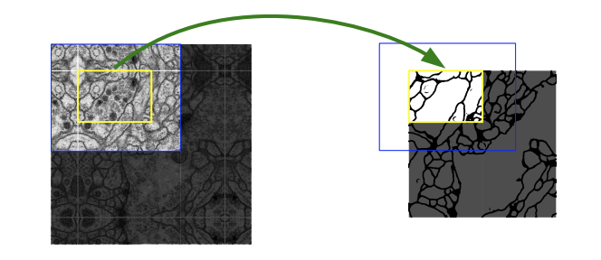

<!--
headingDivider: 1
-->

# Abstract

ディープネットワークの学習を成功させるには、何千ものアノテーション付きトレーニングサンプルが必要だというのが一般的な認識です。

本論文では、限られたアノテーション付きデータをより効率的に活用するためのデータ拡張に依拠したネットワークおよび学習戦略を提案します。

このアーキテクチャは、contextを捉えるための収縮パス(contracting path)と、精密な位置特定を可能にする対称的な拡張パス(symmetric expanding path)から構成されます。

---

我々は、このようなネットワークが非常に少ない画像からエンドツーエンドで学習可能であり、神経構造の電子顕微鏡スタック画像におけるセグメンテーションを対象としたISBIチャレンジにおいて、これまでの最良手法（スライディングウィンドウ型の畳み込みネットワーク）を上回ることを示します。

同じネットワークを透過光顕微鏡画像（位相差および微分干渉コントラスト）に対して学習させた場合でも、我々はISBI 2015年のセル追跡チャレンジにおいて、これらのカテゴリで大差をつけて勝利しました。

---

さらに、このネットワークは高速です。512×512の画像のセグメンテーションには、最近のGPUで1秒未満しかかかりません。

本実装（Caffeをベースとしたもの）および学習済みネットワークは、以下のURLで入手可能です：
http://lmb.informatik.uni-freiburg.de/people/ronneber/u-net

# 1.Introduction

過去二年間で、深層畳み込みネットワーク（deep convolutional networks）は，多くの視覚認識タスク（visual recognition tasks）において最先端技術（state of the art）を上回る性能を示してきました。

畳み込みネットワーク（convolutional networks）は以前から存在していましたが ，利用可能な学習データセットの規模やネットワーク構造の大きさが限られていたため，成功は限定的でした。

Krizhevskyらによる画期的な成果 [7]は，8層で数百万個のパラメータを持つ大規模ネットワークを，100万枚の学習画像からなるImageNetデータセットで教師あり学習したことによるものです。

それ以降，さらに大規模かつ深いネットワークが次々と訓練されています 。

畳み込みネットワークの典型的な用途は分類タスクであり、画像に対して単一のクラスラベルを出力するものです。

しかし、多くの視覚タスク、特に生物医学的画像処理においては，位置情報（localization）を含める必要があり，すなわち各画素（ピクセル）ごとにクラスラベルを割り当てる必要があります。

さらに，生物医学タスクでは何千枚もの訓練画像を用意することは通常困難です。

そこで Ciresanら はスライディング・ウィンドウ方式(画像上を小さなウィンドウ（パッチ）で走査し，その領域ごとに分類器を適用する手法)でネットワークを訓練し，各画素を中心とした局所領域（パッチ）を入力として与えることで画素ごとのクラスラベルを予測しました。

このネットワークは局所化（localization）が可能になる。

パッチ単位で見ると，訓練データ量は画像枚数に比べてはるかに増大する。

この手法により得られたネットワークは，EM セグメンテーションチャレンジ（ISBI 2012）において大差で優勝しました。

明らかに Ciresanらの手法には二つの欠点があります。

ネットワークを各パッチごとに個別に実行しなければならず，重なり合うパッチによる計算の冗長性が大きいため，非常に遅い。

局所化精度とcontext利用の間にトレードオフがある。

大きなパッチでは多くのプーリング層が必要になり，局所化精度が低下する一方で，小さなパッチではネットワークが参照できるcontextが限られてしまう。

より最近のアプローチ［11,4］では，複数の層からの特徴量を同時に考慮できる分類器出力を提案している。

これにより，優れた局所化精度とcontext usageを同時に実現可能となる。

---

この論文では、より洗練されたアーキテクチャである「完全畳み込みネットワーク（Fully Convolutional Network, FCN）」［9］に基づいて構築を行っています。

私たちは、このアーキテクチャを修正・拡張し、少数の学習画像でも機能し、より精密なセグメンテーションを実現できるようにしています（図1参照）。

FCNの主なアイデアは、通常の収縮型ネットワークに、プーリング演算子をアップサンプリング演算子に置き換えた連続層を補足することです。

これにより、これらの層は出力の解像度を向上させます。位置を特定するために、収縮パスからの高解像度特徴量をアップサンプリングされた出力と組み合わせます。

その後の畳み込み層が、この情報を基にしてより精密な出力を構成することを学習できます。

---

我々のアーキテクチャにおける重要な修正点の一つは、アップサンプリング部分においても多くの特徴チャネルを持たせていることです。

これにより、ネットワークは文脈情報を高解像度の層へ伝播させることができます。

その結果、拡張経路（expansive path）は収縮経路（contracting path）とほぼ対称になっており、U字型のアーキテクチャが得られます。

このネットワークは全結合層を一切持たず、各畳み込みの「有効な部分」のみを使用します。

つまり、セグメンテーションマップには、入力画像内で完全な文脈が得られる画素のみが含まれます。

---

この戦略により、「オーバーラップ・タイル戦略（overlap-tile strategy）」（図2参照）を用いた、任意の大きさの画像のシームレスなセグメンテーションが可能になります。

画像の境界領域にある画素を予測するために、不足している文脈情報は入力画像を反転させることで外挿されます。

このタイル戦略は、大きな画像に対してネットワークを適用するために重要です。

なぜなら、そうしなければ解像度がGPUメモリによって制限されてしまうからです。

---

多くの細胞セグメンテーションタスクにおけるもう一つの課題は、同じクラスに属する接触しているオブジェクトの分離です（図3参照）。

図3. DIC（微分干渉コントラスト）顕微鏡を用いてガラス上で記録されたHeLa細胞。
(a) 生画像。
(b) 正解セグメンテーションとの重ね合わせ。異なる色が異なるHeLa細胞のインスタンスを示している。
(c) 生成されたセグメンテーションマスク（白：前景、黒：背景）。
(d) ネットワークに境界ピクセルの学習を促すための、画素単位の損失重み付きマップ。

---

この目的のために、我々は **重み付き損失関数（weighted loss）** の使用を提案します。

ここでは、接触している細胞の間を分離する背景ラベルに対して損失関数内で大きな重みを与えます。

# Network Architecture

ネットワークアーキテクチャは[図1](Figure 1)に示されています。

これは、収縮経路（左側）と拡張経路（右側）から構成されています。

収縮経路は、畳み込みネットワークの典型的なアーキテクチャに従っています。

これは、3×3の畳み込み（パディングなし）を2回適用し、それぞれの後に修正線形単位（ReLU）と、ストライド2による2×2の最大プーリング操作を行うという繰り返しで構成されています。

各ダウンサンプリングステップごとに、特徴チャネルの数を倍にします。

---

拡張経路の各ステップでは、特徴マップのアップサンプリング、特徴チャネルの数を半分にする2×2の畳み込み（「アップコンボリューション」）、収縮経路から対応するクロップされた特徴マップとの連結、そして2回の3×3の畳み込み（それぞれReLUの後に続く）を行います。

クロッピングが必要なのは、各畳み込みにおいて境界ピクセルが失われるためです。

最終層では、1×1の畳み込みによって、各64成分の特徴ベクトルを目的のクラス数にマッピングします。ネットワーク全体で、畳み込み層は23層あります。

---

出力セグメンテーションマップのシームレスなタイル化を可能にするために（[図2](Figure 2)参照）、すべての2×2最大プーリング操作が、x方向およびy方向のサイズが偶数のレイヤーに適用されるように、入力タイルサイズを選択することが重要です。

# 3.Training

入力画像とそれに対応するセグメンテーションマップは、Caffe［6］の確率的勾配降下法（stochastic gradient descent）の実装を用いてネットワークの訓練に使用されます。

パディングなしの畳み込みにより、出力画像は入力画像よりも一定の幅だけ小さくなります。

オーバーヘッドを最小限に抑え、GPUメモリを最大限に活用するために、我々は大きなバッチサイズよりも大きな入力タイルを好み、そのためバッチを単一の画像に減らします。それに応じて、以前に見た多数の訓練サンプルが現在の最適化ステップでの更新に影響を与えるように、モーメンタム0.99という高い値を使用します。

---

損失関数は、最終的な特徴マップに対して画素単位のソフトマックスを適用し、クロスエントロピー損失関数と組み合わせて計算されます。

ソフトマックスは以下のように定義されます：

$$
p_k(\mathbf{x}) = \frac{\exp(a_k(\mathbf{x}))}{\sum_{k'=1}^K \exp(a_{k'}(\mathbf{x}))}
$$

ここで、$a_k(\mathbf{x})$ は、位置 $\mathbf{x} \in \Omega$ における特徴チャネル $k$ の活性値を表します（$\Omega \subset \mathbb{Z}^2$）。

---

$K$ はクラスの数であり、$p_k(\mathbf{x})$ は近似された最大関数です。
すなわち、$a_k(\mathbf{x})$ が最大となる $k$ に対して $p_k(\mathbf{x}) \approx 1$ となり、その他の $k$ に対しては $p_k(\mathbf{x}) \approx 0$ となります。

クロスエントロピーは、各位置における $p_{\ell(\mathbf{x})}(\mathbf{x})$ の1からのずれに対してペナルティを課します：

$$
E = \sum_{\mathbf{x} \in \Omega} w(\mathbf{x}) \log(p_{\ell(\mathbf{x})}(\mathbf{x}))
\tag{1}
$$

ここで、$\ell : \Omega \rightarrow \{1, \dots, K\}$ は各画素の正解ラベルを表し、
$w : \Omega \rightarrow \mathbb{R}$ は、訓練時に特定の画素により重要性を与えるために導入された重みマップです。

---

我々は、各グラウンドトゥルースセグメンテーションに対して、重みマップを事前に計算します。

これは、訓練データセット内で特定のクラスに属する画素の頻度の違いを補正するため、および接触している細胞間に導入した小さな分離境界をネットワークに学習させるためです（図 3c および d を参照）。

---

セパレーションボーダー（分離境界）は、モルフォロジー演算（morphological operations）を用いて計算されます。
重みマップは次のように計算されます：

$$
w(\mathbf{x}) = w_c(\mathbf{x}) + w_0 \cdot \exp\left( -\frac{(d_1(\mathbf{x}) + d_2(\mathbf{x}))^2}{2\sigma^2} \right)
\tag{2}
$$

ここで：

- $w_c : \Omega \to \mathbb{R}$ は、クラス頻度を補正するための重みマップ背景ピクセルと細胞ピクセルの出現頻度が異なる。そのため、頻度の低いクラスに対して大きな重みを与える設計になっている
- $d_1 : \Omega \to \mathbb{R}$ は、最も近い細胞の境界までの距離
- $d_2 : \Omega \to \mathbb{R}$ は、2番目に近い細胞の境界までの距離

我々の実験では、$w_0 = 10$ および $\sigma \approx 5$ ピクセルと設定しました。

---

ディープネットワークにおいて、多数の畳み込み層やネットワーク内の異なる経路が存在する場合、重みの良好な初期化は極めて重要です。
そうでないと、ネットワークの一部が過剰な活性化を起こしたり、他の部分が全く寄与しなかったりする可能性があります。

理想的には、ネットワーク内の各特徴マップがほぼ単位分散（unit variance）を持つように、初期重みは適切に調整されるべきです。

---

我々のアーキテクチャ（畳み込み層とReLU層が交互に配置される）では、
初期重みをガウス分布（正規分布）から以下の標準偏差でサンプリングすることで、この目的を達成できます：

$$
\text{標準偏差} = \sqrt{\frac{2}{N}}
$$

ここで $N$ は、ある1つのニューロンに入力されるノード（ユニット）の数を表します[^5]。

例えば、3×3の畳み込みと、前の層に64チャネルの特徴マップがある場合には：

$$
N = 3 \cdot 3 \cdot 64 = 576
$$

# 4.Experiments

私たちは、U-Netの応用を3つの異なるセグメンテーション課題に対して実証しました。

最初の課題は、電子顕微鏡記録における神経構造のセグメンテーションです。

データセットの一例と、私たちが得たセグメンテーション結果は図2に示されています。

---

図2. 任意の大きさの画像をシームレスにセグメンテーションするためのオーバーラップタイル戦略（ここではEMスタックにおける神経構造のセグメンテーション）。
黄色の領域でのセグメンテーションを予測するには、青色の領域内の画像データを入力として必要とする。
不足している入力データは、ミラーリングによって外挿される。

---

完全な結果は補足資料として提供しています。

このデータセットは、ISBI 2012で開始された **EMセグメンテーションチャレンジ[14]** によって提供されており、現在も新たな投稿を受け付けています。
トレーニングデータは、 **ショウジョウバエ（Drosophila）第1齢幼虫の腹側神経索（VNC）を連続切片透過型電子顕微鏡で撮影した30枚の画像（512×512ピクセル）** で構成されています。

各画像には、細胞（白）および膜（黒）に対応した完全にアノテーションされた正解のセグメンテーションマップが付属しています。

テストセットは公開されていますが、そのセグメンテーションマップは非公開となっています。

---

評価は、予測された膜の確率マップを主催者に送付することで行うことができます。

評価は、10段階の異なるしきい値でマップを二値化し、次の3つの指標を計算することで行われます：

- 「ワーピングエラー（warping error）」
- 「Randエラー（Rand error）」
- 「ピクセルエラー（pixel error）」

---

U-Netは、入力データを7つの回転バージョンにして平均を取った場合、追加の前処理や後処理を一切行わずに、ワーピングエラーが 0.0003529（新たな最良スコア。表1を参照）、およびRandエラーが 0.0382という結果を達成しました。

これは、Ciresanら[1]によるスライディングウィンドウ型畳み込みネットワークの結果よりも明らかに優れています。彼らの最良の投稿では、ワーピングエラーが 0.000420、Randエラーが 0.0504でした。

Randエラーに関してこのデータセットでU-Netよりも良い結果を示したアルゴリズムは、Ciresanら[1]の確率マップに対して非常にデータセット特化型の後処理手法を適用したものに限られます。

---

私たちはまた、U-Netを光学顕微鏡画像における細胞セグメンテーション課題にも適用しました。

このセグメンテーション課題は、ISBI Cell Tracking Challenge 2014年および2015年の一部です [10,13]。

---

図4. ISBI細胞追跡チャレンジにおける結果。
(a) 「PhC-U373」データセットの入力画像の一部。(b) セグメンテーション結果（シアンのマスク）と手動で作成された正解データ（黄色の枠線）。(c) 「DIC-HeLa」データセットの入力画像。(d) セグメンテーション結果（ランダムな色のマスク）と手動で作成された正解データ（黄色の枠線）。

---

最初のデータセット「PhC-U373」²には、ポリカリミド基板上のグリオブラストーマ・アストロサイトーマU373細胞が、位相差顕微鏡で記録された画像が含まれています（図4a,bおよび補足資料を参照）。

このデータセットには、部分的にアノテーションされた35枚のトレーニング画像が含まれています。

この課題において、私たちは **平均IOU（“intersection over union”、交差部分と和集合の比）で92%** を達成しました。
これは、次点のアルゴリズムの83%よりも明らかに優れた結果です（表2を参照）。

---

2つ目のデータセット「DIC-HeLa」³は、平らなガラス上にあるHeLa細胞を微分干渉コントラスト（DIC）顕微鏡で記録したものです（図3、図4c,dおよび補足資料を参照）。

このデータセットには、部分的にアノテーションされた20枚のトレーニング画像が含まれています。

この課題において、私たちは **平均IOUで77.5%** を達成しました。
これは、次点のアルゴリズムの46%よりも明らかに優れています。

---

表2. ISBI Cell Tracking Challenge 2015におけるセグメンテーション結果（IOU）。

# 5.Conclusion

U-Netアーキテクチャは、非常に異なる生物医学的セグメンテーションの応用において、非常に優れた性能を発揮します。

弾性変形によるデータ拡張のおかげで、アノテーションされた画像が非常に少なくても済み、トレーニング時間もNVidia Titan GPU（6 GB）でわずか10時間という非常に合理的な時間で済みます。

私たちは、Caffe[6]ベースの実装および学習済みネットワークをすべて提供しています。

U-Netアーキテクチャは、さらに多くのタスクにも簡単に適用できると私たちは確信しています。